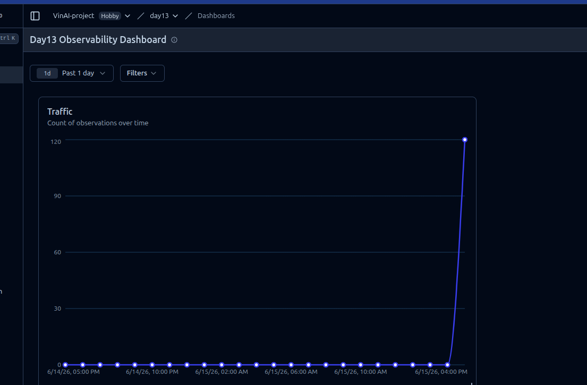
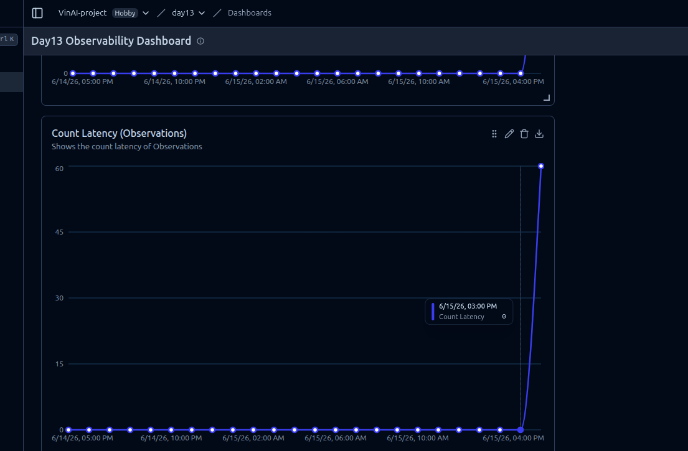
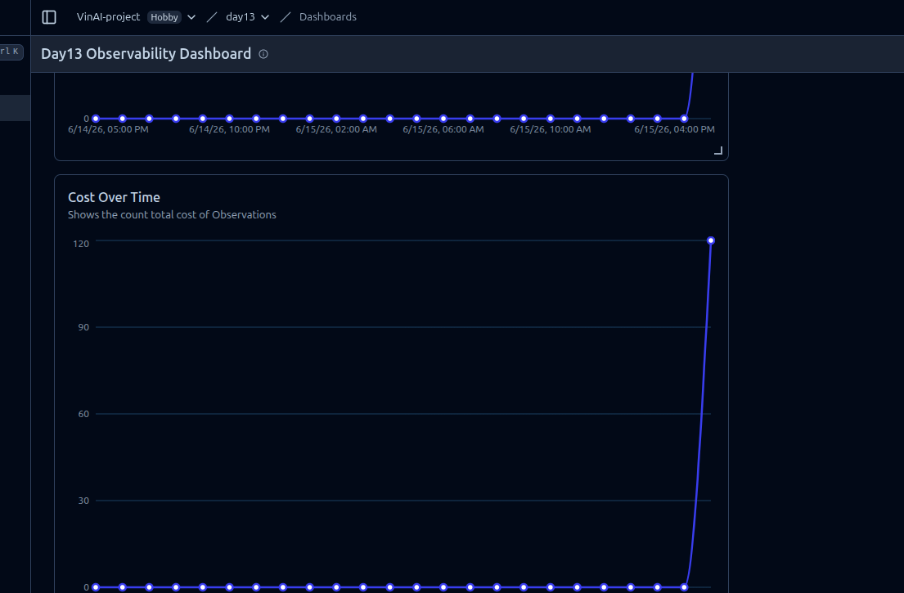
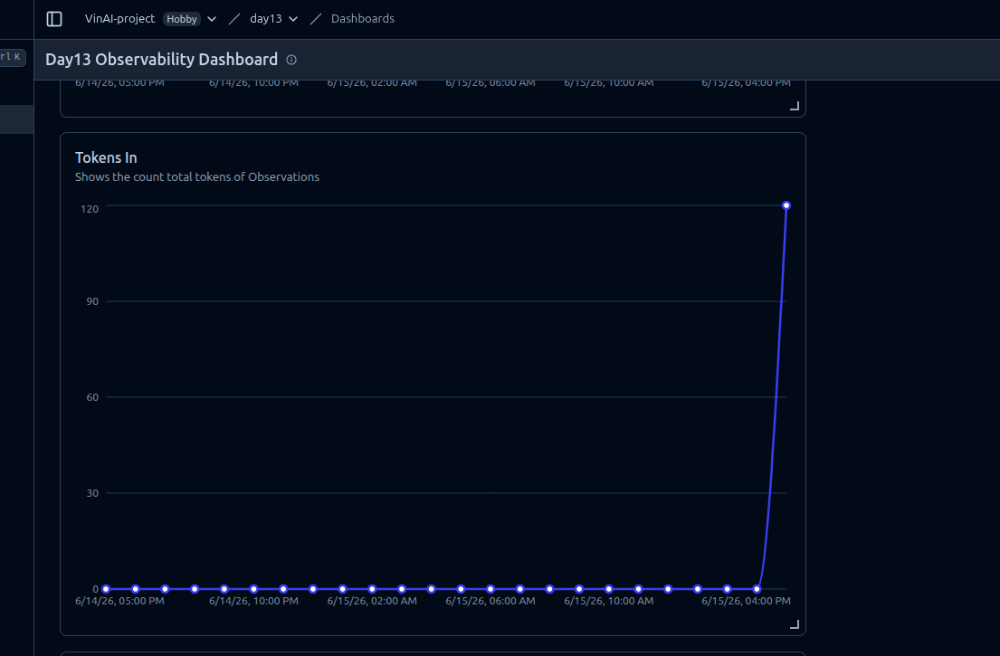
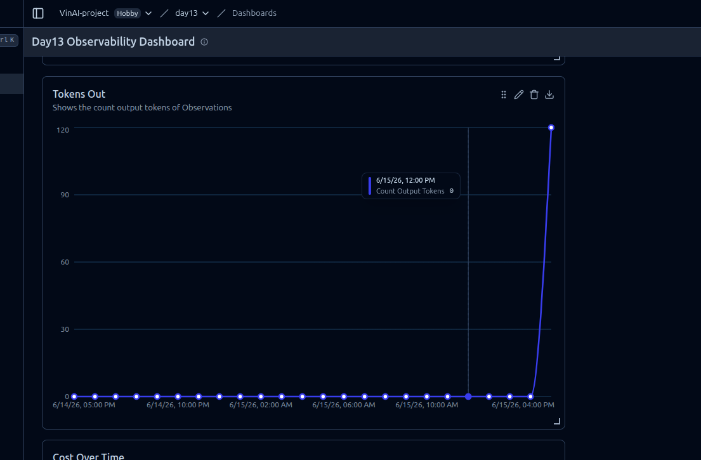

# Báo cáo Observability Lab - Tran Van Huynh

## 1. Thông tin chung
- Họ tên: Tran Van Huynh
- Hình thức làm bài: Cá nhân
- Repo: https://github.com/huynhtv16/2A202600805-TranVanHuynh-Day13.git
- Chủ đề: Monitoring, Logging và Observability cho ứng dụng FastAPI dạng agent

## 2. Tóm tắt kết quả
- Điểm kiểm tra log hiện tại: 100/100
- Tracing: đã ghi nhận ít nhất 10 traces trên Langfuse sau khi sửa tracing và chạy load test
- PII leak: không phát hiện dữ liệu nhạy cảm bị lộ trong log
- Dashboard: đã chuẩn bị đủ 6 panel chính
- Alert: đã có alert nội bộ trong app cho latency, error rate và cost spike

## 3. Kết quả chạy thực tế
- Lệnh load test: `python scripts/load_test.py --concurrency 5`
- Kết quả load test: 10/10 request trả về HTTP 200
- Latency client ghi nhận trong lần chạy: khoảng 474.0ms đến 826.9ms
- Lệnh bật incident: `python scripts/inject_incident.py --scenario rag_slow`
- Kết quả bật incident: HTTP 200, trạng thái `rag_slow=True`, `tool_fail=False`, `cost_spike=False`
- Lệnh kiểm tra log: `python scripts/validate_logs.py`
- Tổng số log record được phân tích: 334
- Record thiếu required fields: 0
- Record thiếu enrichment context: 0
- Số correlation ID unique: 160
- Potential PII leaks detected: 0
- Estimated Score: 100/100

Kết quả trên chứng minh các phần quan trọng của logging đã hoạt động đúng: log đúng JSON schema, correlation ID được truyền xuyên suốt, context enrichment không bị thiếu và PII scrubbing không phát hiện leak

## 4. Nội dung đã triển khai

### 4.1 Logging và correlation ID
Ứng dụng đã được bổ sung cơ chế truyền `correlation_id` xuyên suốt request. Middleware đọc hoặc tạo `x-request-id`, gắn vào log context và trả lại header cho client. Nhờ vậy khi debug có thể lần theo toàn bộ vòng đời của một request từ log đến trace

Log cũng được bổ sung thêm các thông tin phục vụ quan sát hệ thống như `user_id_hash`, `session_id`, `feature`, `model` và `env`. Các trường này giúp phân tích lỗi theo người dùng, phiên làm việc, tính năng hoặc model đang sử dụng

### 4.2 PII scrubbing
Phần xử lý PII đã được cấu hình trước khi ghi structured log. Các dữ liệu nhạy cảm như email, số điện thoại, địa chỉ, passport hoặc thông tin cá nhân khác được che lại để giảm rủi ro lộ dữ liệu khi đọc log

### 4.3 Tracing
Langfuse tracing đã được kiểm tra lại để ghi nhận đầy đủ quá trình xử lý request. Trace `run` thể hiện các bước chính trong luồng agent. Incident `rag_slow` đã được bật thành công qua script control, dùng để kiểm tra đường xử lý chậm ở bước retrieval khi cần demo hoặc debug latency

### 4.4 Metrics và dashboard
Ứng dụng có metric cho latency, traffic, error, token, cost và quality proxy. Các snapshot metric được export để dựng dashboard và phục vụ phần bằng chứng khi nộp bài

## 5. Bằng chứng dashboard

### 5.1 Traffic

Panel này thể hiện lượng request theo thời gian, dùng để quan sát traffic và phát hiện thay đổi bất thường về số request

### 5.2 Latency

Panel latency dùng để theo dõi độ trễ xử lý request, đặc biệt là các chỉ số tail latency như P95 hoặc P99 khi hệ thống có incident

### 5.3 Cost over time

Panel cost giúp theo dõi chi phí theo thời gian. Đây là bằng chứng quan trọng cho scenario `cost_spike`, khi số output token tăng làm chi phí request tăng theo

### 5.4 Tokens in

Panel này cho biết lượng input token được gửi vào model. Chỉ số này giúp đánh giá prompt có đang quá dài hoặc tăng bất thường hay không

### 5.5 Tokens out

Panel này cho biết lượng output token sinh ra từ model. Khi `tokens_out` tăng mạnh, chi phí cũng có thể tăng theo nên đây là chỉ số cần theo dõi sát

### 5.6 Unique users

Panel unique users cho biết số lượng người dùng khác nhau được ghi nhận trong dữ liệu metric. Chỉ số này giúp phân biệt traffic tăng do nhiều người dùng thật hay do một nhóm request lặp lại

## 6. SLO

| SLI | Mục tiêu | Cửa sổ đo | Giá trị ghi nhận |
|---|---:|---|---:|
| Latency P95 | < 3000ms | 28 ngày | Load test gần nhất trả HTTP 200, latency client khoảng 474.0-826.9ms |
| Error Rate | < 2% | 28 ngày | 0 lỗi trong 10 request load test gần nhất |
| Cost Budget | < $2.5/ngày | 1 ngày | 0.083 USD trong test cost-spike burst |

## 7. Alert và runbook

Alert hiện tại là alert nội bộ của ứng dụng, chưa phải tích hợp Prometheus/Grafana/Slack. Các rule được đọc từ `config/alert_rules.yaml` qua hàm `load_alert_rules()` trong `app/alerts.py`. Endpoint `/alerts` gọi `evaluate_alerts()`, lấy metric hiện tại từ `app.metrics.snapshot()`, parse condition bằng regex `CONDITION_RE`

### 7.1 High latency P95
- Mức độ: P2
- Điều kiện trong YAML: `latency_p95_ms > 2500 for 1m`
- Metric dùng để so sánh: `latency_p95_ms`, lấy từ percentile P95 của `REQUEST_LATENCIES`
- Owner: `team-oncall`
- Type: `symptom-based`
- Runbook: `docs/alerts.md#1-high-latency-p95`
- Khi firing: P95 latency của snapshot hiện tại lớn hơn 2500ms
- Cách xử lý: kiểm tra trace chậm nhất, so sánh RAG span với LLM span, kiểm tra incident `rag_slow` và giảm kích thước prompt/context nếu retrieval hoặc LLM span tăng bất thường

### 7.2 High error rate
- Mức độ: P1
- Điều kiện trong YAML: `error_rate_pct > 5 for 1m`
- Metric dùng để so sánh: `error_rate_pct`, tính từ `ERRORS / (TRAFFIC + ERRORS) * 100`
- Owner: `team-oncall`
- Type: `symptom-based`
- Runbook: `docs/alerts.md#2-high-error-rate`
- Khi firing: tỷ lệ lỗi của snapshot hiện tại lớn hơn 5%
- Cách xử lý: nhóm log theo `error_type`, kiểm tra failed traces, xác định lỗi đến từ LLM, tool, schema hoặc tầng API, sau đó rollback hoặc tắt tool lỗi nếu cần

### 7.3 Cost budget spike
- Mức độ: P2
- Điều kiện trong YAML: `hourly_cost_usd > 0.04 for 1m`
- Metric dùng để so sánh: `hourly_cost_usd`, hiện đang là alias của `total_cost_usd` trong snapshot
- Owner: `finops-owner`
- Type: `symptom-based`
- Runbook: `docs/alerts.md#3-cost-budget-spike`
- Khi firing: tổng chi phí ghi nhận trong snapshot hiện tại lớn hơn 0.04 USD
- Cách xử lý: kiểm tra `tokens_in_total`, `tokens_out_total`, feature và model gây tăng chi phí, sau đó rút ngắn prompt, giới hạn output hoặc route request đơn giản sang model rẻ hơn

## 8. Incident response

### Scenario: `rag_slow`
- Triệu chứng kỳ vọng: latency tăng do bước retrieval chạy chậm hơn bình thường
- Bằng chứng đã chạy: `python scripts/inject_incident.py --scenario rag_slow` trả HTTP 200 và xác nhận `rag_slow=True`
- Nguyên nhân: incident toggle `rag_slow` làm đường retrieval giả lập chậm lại, từ đó có thể đẩy P95 latency lên cao
- Cách kiểm chứng tiếp: chạy lại `python scripts/load_test.py --concurrency 5`, xem `/metrics`, `/alerts` và latency panel để xác nhận `latency_p95_ms` có vượt ngưỡng `2500` hay không
- Cách khắc phục: tắt incident `rag_slow`, kiểm tra lại alert về trạng thái `ok`, sau đó đối chiếu trace để xác nhận retrieval span đã trở lại bình thường
- Phòng ngừa: đặt timeout cho retrieval, giới hạn số context trả về, dùng nguồn retrieval dự phòng và duy trì alert `high_latency_p95`

## 9. Đóng góp cá nhân
- Hoàn thiện middleware truyền `correlation_id`
- Bổ sung log enrichment và PII scrubbing
- Sửa tích hợp Langfuse tracing
- Triển khai alert evaluation dựa trên YAML
- Bổ sung endpoint `/alerts`
- Export metric snapshot để dựng dashboard
- Chuẩn bị dashboard 6 panel và ảnh bằng chứng trong thư mục `images`
- Hoàn thiện tài liệu báo cáo và runbook

## 10. Kết luận
Bài lab đã triển khai được các thành phần quan trọng của observability gồm logging, tracing, metrics, dashboard, alert và incident response. Các ảnh trong thư mục `images` là bằng chứng trực quan cho phần dashboard, còn các file cấu hình và tài liệu trong repo thể hiện cách hệ thống được kiểm tra, giám sát và xử lý khi có sự cố
